# TAK Base Infrastructure - Production Architecture

This diagram shows the AWS resources deployed when using the `prod` environment type.

```mermaid
graph TB
    %% VPC and Network Layer
    subgraph "AWS Region"
        subgraph "VPC (10.x.x.0/20)"
            direction TB
            
            %% Internet Gateways
            IGW[Internet Gateway<br/>IPv4/IPv6]
            EIGW[Egress-Only IGW<br/>IPv6 Only]
            
            %% Availability Zone A
            subgraph "AZ-A"
                direction TB
                PubSubA[Public Subnet A<br/>10.x.x.0/24]
                PrivSubA[Private Subnet A<br/>10.x.x.64/26]
                EIPA[Elastic IP A]
                NATA[NAT Gateway A]
                
                PubSubA --> NATA
                EIPA --> NATA
            end
            
            %% Availability Zone B  
            subgraph "AZ-B"
                direction TB
                PubSubB[Public Subnet B<br/>10.x.x.16/24]
                PrivSubB[Private Subnet B<br/>10.x.x.80/26]
                EIPB[Elastic IP B]
                NATB[NAT Gateway B]
                
                PubSubB --> NATB
                EIPB --> NATB
            end
            
            %% Route Tables
            PubRT[Public Route Table]
            PrivRTA[Private Route Table A]
            PrivRTB[Private Route Table B]
            
            %% Route connections
            PubRT --> IGW
            PrivRTA --> NATA
            PrivRTB --> NATB
            PrivRTA --> EIGW
            PrivRTB --> EIGW
        end
        
        %% Compute Resources
        subgraph "Compute Services"
            ECS[ECS Cluster<br/>Fargate]
            ECR[ECR Repository<br/>Container Images]
        end
        
        %% Storage & Security
        subgraph "Storage & Security"
            S3[S3 Bucket<br/>Config Storage<br/>KMS Encrypted]
            KMS[KMS Key & Alias<br/>Encryption]
        end
        
        %% VPC Endpoints (Prod Only)
        subgraph "VPC Endpoints (Prod Only)"
            VPE_S3[S3 Gateway Endpoint]
            VPE_ECR_DKR[ECR DKR Interface]
            VPE_ECR_API[ECR API Interface]
            VPE_KMS[KMS Interface]
            VPE_SM[Secrets Manager Interface]
            VPE_CW[CloudWatch Logs Interface]
        end
    end
    
    %% External connections
    Internet((Internet))
    
    %% Network flow connections
    IGW <--> Internet
    EIGW --> Internet
    
    %% VPC Endpoint connections
    PrivSubA --- VPE_ECR_DKR
    PrivSubA --- VPE_ECR_API
    PrivSubA --- VPE_KMS
    PrivSubA --- VPE_SM
    PrivSubA --- VPE_CW
    
    PrivSubB --- VPE_ECR_DKR
    PrivSubB --- VPE_ECR_API
    PrivSubB --- VPE_KMS
    PrivSubB --- VPE_SM
    PrivSubB --- VPE_CW
    
    PrivRTA --- VPE_S3
    PrivRTB --- VPE_S3
    
    %% Service connections
    ECS -.-> ECR
    S3 -.-> KMS
    
    %% Styling
    classDef vpc fill:#e1f5fe
    classDef subnet fill:#f3e5f5
    classDef gateway fill:#e8f5e8
    classDef endpoint fill:#fff3e0
    classDef service fill:#fce4ec
    classDef storage fill:#f1f8e9
    
    class VPC vpc
    class PubSubA,PubSubB,PrivSubA,PrivSubB subnet
    class IGW,EIGW,NATA,NATB gateway
    class VPE_S3,VPE_ECR_DKR,VPE_ECR_API,VPE_KMS,VPE_SM,VPE_CW endpoint
    class ECS,ECR service
    class S3,KMS storage
```

## Key Production Features

### High Availability
- **Dual AZ deployment**: Resources span two availability zones
- **Redundant NAT Gateways**: Each AZ has its own NAT Gateway for fault tolerance
- **IPv4/IPv6 dual stack**: Full support for both IP versions

### Security & Compliance
- **Private subnets**: Application workloads isolated from direct internet access
- **VPC Endpoints**: Private connectivity to AWS services (no internet routing)
- **KMS encryption**: All data encrypted at rest using customer-managed keys
- **Security groups**: Network-level access controls (implicit)

### Network Architecture
- **CIDR calculation**: Dynamic /20 VPC from 10.0.0.0/8 using Major/Minor ID system
- **Route isolation**: Separate route tables for public and private subnets
- **Gateway diversity**: Internet Gateway for public, NAT + Egress-Only for private

### Cost Optimization (vs Dev-Test)
- **VPC Endpoints**: Reduce NAT Gateway data charges for AWS service calls
- **Dedicated NAT per AZ**: Better performance and fault isolation
- **Enhanced monitoring**: CloudWatch integration via VPC endpoint

## Resource Count (Production)
| Resource Type | Count | Notes |
|---------------|-------|-------|
| VPC | 1 | Single /20 network |
| Subnets | 4 | 2 public + 2 private |
| NAT Gateways | 2 | One per AZ |
| VPC Endpoints | 6 | S3 Gateway + 5 Interface |
| ECS Cluster | 1 | Fargate-enabled |
| ECR Repository | 1 | With lifecycle policy |
| S3 Bucket | 1 | KMS encrypted |
| KMS Key | 1 | With alias |

## Cost Implications
Production deployment includes additional resources that significantly increase costs:
- **2x NAT Gateways**: ~$90/month base cost
- **5x Interface VPC Endpoints**: ~$36/month base cost  
- **Data processing fees**: Variable based on usage
- **Total base cost**: ~$126/month + usage fees
